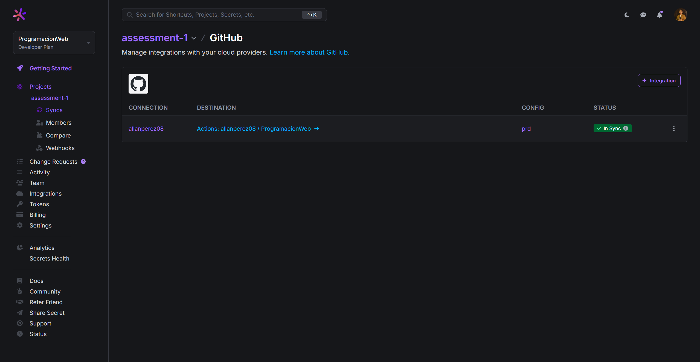
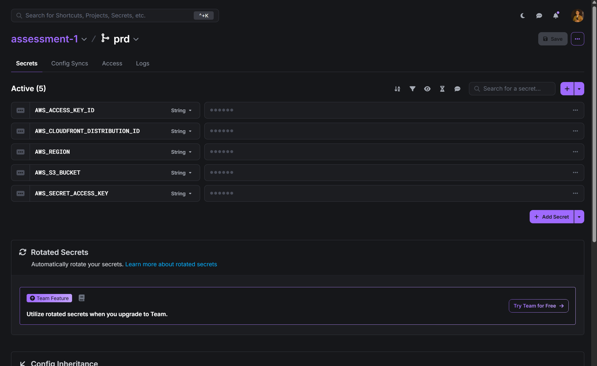
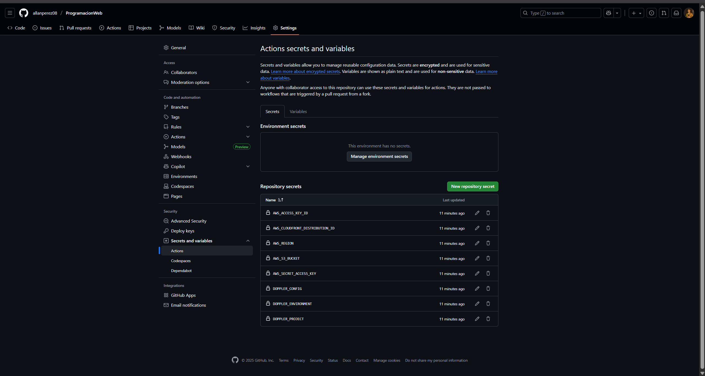
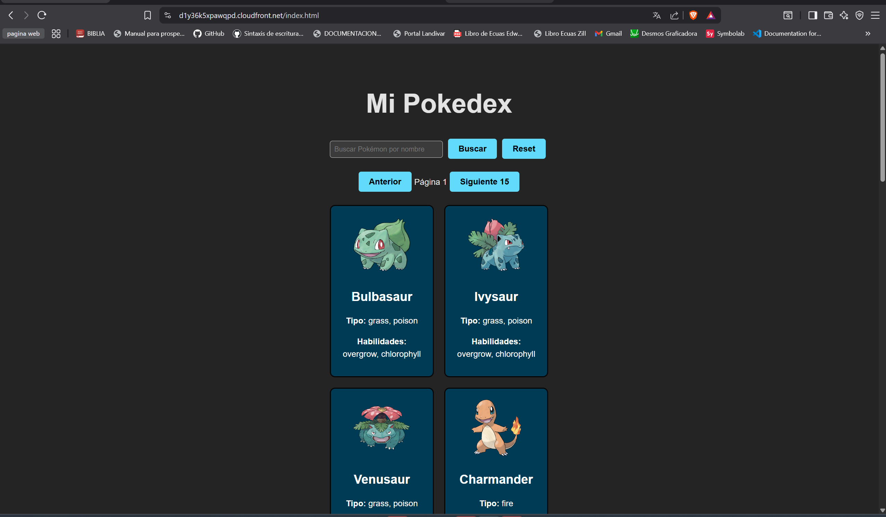
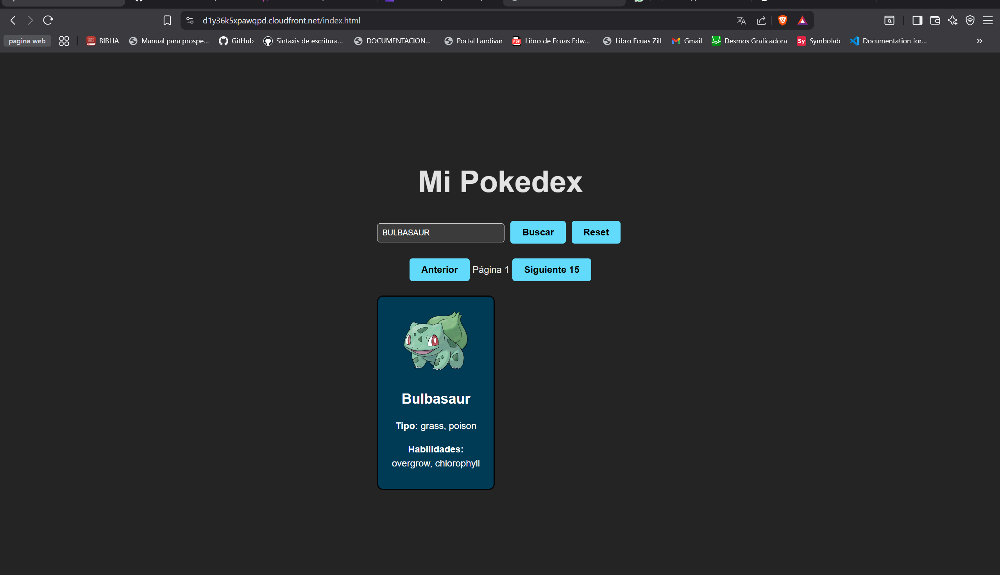
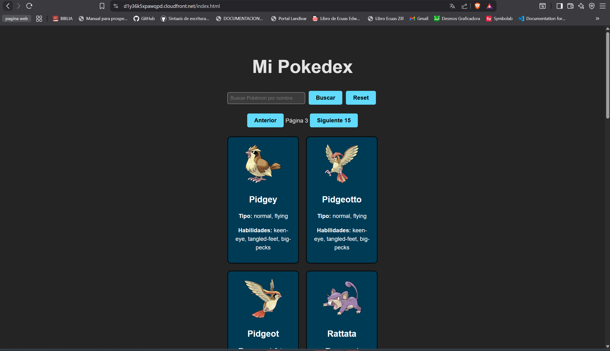

Captura de pantalla de la pestaña "Config Syncs" de Doppler mostrando la integración con su repositorio.

Captura de pantalla de sus variables de Doppler (ocultando valores).

Captura de pantalla de los secretos en GitHub.

Captura de la aplicación mostrando las tarjetas de Pokémon.

URL pública del CDN de CloudFront para acceder a la aplicación.
https://d1y36k5xpawqpd.cloudfront.net/index.html
